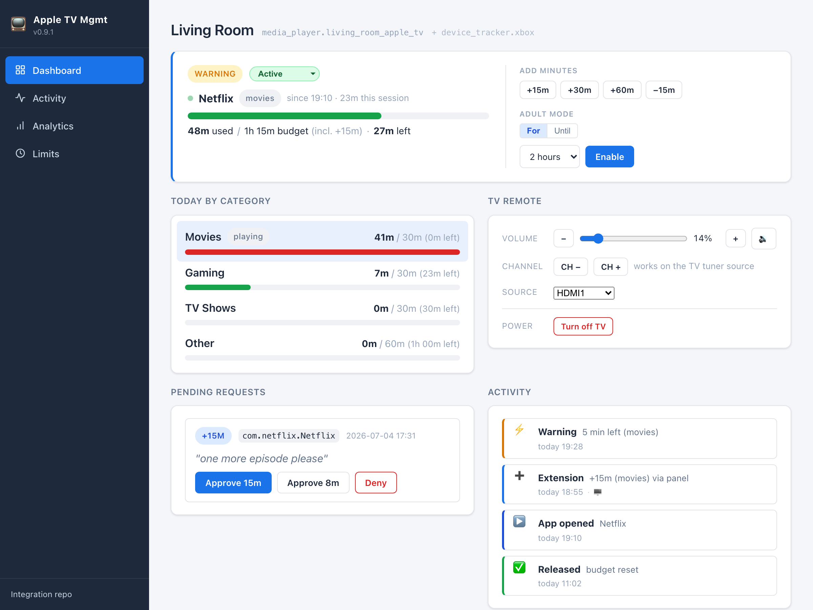

# Apple TV Mgmt

[](https://github.com/hacs/integration) [](https://www.home-assistant.io/) [](LICENSE)

> A Home Assistant custom integration for **kids' screen-time on the living-room TV**. It tracks usage per app, enforces a daily (and per-category) time budget by putting the Apple TV to sleep and turning the TV off, speaks a friendly heads-up before time runs out, and exposes services + a REST API + an optional admin panel for parental-control automations. A **game console** (e.g. Xbox, via presence + a router internet switch) can share the same room budget. **AdGuard Home is an optional extra DNS-block layer — not required.**



*Above: the optional [companion admin panel](https://github.com/jarvis2k1/ha-appletv-mgmt-panel) (a separate add-on). The integration itself is headless — it works through sensors, services, and a REST API — but the panel is the friendliest way to run day-to-day parent controls.*

```
┌────────────────┐    state changes    ┌────────────────┐   X-API-Key  ┌────────────────┐    HTTP   ┌────────────────┐
│  media_player  │ ──────────────────▶ │ appletv_mgmt   │ ──────────▶  │  appletv-      │ ──────▶   │  AdGuard Home  │
│  (Apple TV)    │      app_id, etc.   │ (HA integ'n)   │              │  adguard-proxy │           │  (addon)       │
└────────────────┘                     └───────┬────────┘              └────────────────┘           └────────────────┘
                                               │ media_player.turn_off
                                               ▼
                                          Apple TV sleeps
                                          (+ HDMI-CEC TV off)
```

**Status:** Actively used on a live family install. Shipped and working today: per-app usage attribution, a daily budget **plus per-category (movies / tv_shows / gaming / other) sub-budgets**, weekday schedules, quiet windows (bedtime/school), enforcement by Apple-TV-sleep + TV-off (AdGuard DNS-block optional), warn/countdown **voice announcements**, a **parent approval flow** for "5 more minutes" requests, adult-mode override, a **REST API**, a sidebar **admin panel** (companion addon), **multi-device** support (a second Apple TV, or an Xbox sharing the room budget), and self-healing for the tvOS 26 pyatv push-death bug. See the [CHANGELOG](CHANGELOG.md) for the full history and [SPEC.md](SPEC.md) for the behavioral contract.

---

## Why this exists

The Apple TV has no native per-app screen-time controls that you can drive from Home Assistant. The available options are coarse (cut the smart plug power), invasive (yank the HDMI), or out-of-band (Apple Screen Time on the Apple ID, which only works if every kid uses the device while signed into their own Apple ID and Family Sharing).

This integration:

1. **Listens** to the Apple TV's media_player entity that the built-in `apple_tv` integration already produces. Every state change is attributed to a bundle id (`com.google.ios.youtube`, etc.). The usage log is append-only and aggregated by local-day window — events spanning midnight are correctly clipped.

2. **Enforces** by flipping the Apple TV's client in AdGuard Home to "all services blocked", then sending `media_player.turn_off` (which sleeps the Apple TV and triggers HDMI-CEC TV-off where supported). When the kid wakes the device, AdGuard still returns `NXDOMAIN` for everything → apps show "no connection".

3. **Self-resets** at local midnight. Extensions added via `appletv_mgmt.grant_extension` are scoped to today only.

For the full behavioral spec see [SPEC.md](SPEC.md).

---

## Repository contents

```
HA AppleTV Mgmt/
├── custom_components/appletv_mgmt/   ← the HA integration (Python)
│   ├── state.py                      ← pure state machine, no HA imports
│   ├── adguard.py                    ← async REST client
│   ├── storage.py                    ← Profile, UsageEvent, AppleTVMgmtStore
│   ├── enforcer.py                   ← wires state machine to side effects
│   ├── coordinator.py                ← DataUpdateCoordinator, usage attribution
│   ├── __init__.py                   ← setup, services
│   ├── config_flow.py                ← UI install + options
│   ├── sensor.py                     ← 5 sensor entities
│   └── ...
├── tests/                            ← ~700 fast, HA-free unit tests
├── SPEC.md                           ← formal specification
├── docs/
│   ├── ARCHITECTURE.md               ← module map + request paths + diagrams
│   └── API.md                        ← services, entities, events, REST API
├── CHANGELOG.md                      ← version-by-version notes
├── hacs.json
└── README.md                         ← you are here
```

**Companion repos:**

| Repo | What it is | Needed? |
|---|---|---|
| [ha-appletv-mgmt-panel](https://github.com/jarvis2k1/ha-appletv-mgmt-panel) | Sidebar admin panel (HA addon) — usage, grant time, TV remote | Recommended |
| [ha-pyatv-tvos26-patch](https://github.com/jarvis2k1/ha-pyatv-tvos26-patch) | Runtime patch for the tvOS 26 / pyatv push-death bug | If on tvOS 26 |
| [ha-appletv-mgmt-adguard-proxy](https://github.com/jarvis2k1/ha-appletv-mgmt-adguard-proxy) | Bridges HA Core to the ingress-only AdGuard Home addon | Only if using the official AdGuard add-on |

---

## Requirements

**Required**

- **Home Assistant** 2026.3+ (uses the modern config-entry, coordinator, and selector APIs).
- **Built-in `apple_tv` integration** already configured — it produces the `media_player.*` entity this integration listens to. (For an Xbox-only profile you instead point at a `device_tracker` + a `switch`; see [Multiple devices](#multiple-devices--a-second-apple-tv-or-an-xbox) — no Apple TV needed for that profile.)

**Recommended**

- A **TV entity** (`media_player.*` for your TV — any brand HA can talk to) as the enforcement kill-switch and liveness signal. Without one, enforcement falls back to Apple-TV-sleep only, and usage tracking is slightly less accurate on tvOS 26 (see [Caveats](#caveats)).
- The **[admin panel addon](https://github.com/jarvis2k1/ha-appletv-mgmt-panel)** — a sidebar UI to see usage, grant time, and drive the TV remote. It's the friendliest way to run day-to-day parent controls.

**Optional**

- **AdGuard Home** as an *extra* DNS-block layer (belt-and-suspenders on top of Apple-TV-sleep + TV-off). Leave the AdGuard fields blank in the config flow to run without it — enforcement still works. If you do use it, either the official HA add-on (ingress-only, via the [proxy addon](https://github.com/jarvis2k1/ha-appletv-mgmt-adguard-proxy)) or a standalone LAN install, with a pre-created persistent client the integration will toggle.
- The **[pyatv tvOS 26 patch](https://github.com/jarvis2k1/ha-pyatv-tvos26-patch)** — a tiny companion integration that works around a tvOS 26 / pyatv bug where the Apple TV's now-playing state silently freezes. Recommended if your Apple TV runs tvOS 26.x.
- **Apple TV's LAN IP** — only for the (off-by-default) DNS-corroborated attribution feature.

---

## Install

### 1. Install the integration (HACS)

[HACS](https://hacs.xyz/) (the Home Assistant Community Store) is the add-on that installs custom integrations for you and keeps them updated. If you don't have it yet, install HACS first — [5-minute guide](https://hacs.xyz/docs/use/download/download/). Apple TV Mgmt is in the **HACS default store**, so there is nothing to add first:

1. Open **HACS** from the sidebar.
2. Search for **Apple TV Mgmt** and open it → **Download**.
3. **Restart Home Assistant** (Settings → System → Restart) so HA picks up the new integration.

Requires **Home Assistant 2026.3 or newer** — HACS will not offer it on older versions.

> **One-click add:** [](https://my.home-assistant.io/redirect/hacs_repository/?owner=jarvis2k1&repository=ha-appletv-mgmt&category=integration)

<details>
<summary>Manual install (no HACS)</summary>

Copy `custom_components/appletv_mgmt/` from this repo into your HA `config/custom_components/` directory and restart HA.
</details>

> **Note on versions:** HACS installs from the repository's latest **GitHub Release**. Make sure you're getting the current release, not an old tag — the newest release is always shown at the top of the [Releases page](https://github.com/jarvis2k1/ha-appletv-mgmt/releases).

### 2. Add a profile

**Settings → Devices & Services → Add Integration → Apple TV Mgmt.** Pick the device kind:

- **Apple TV** — choose the `media_player` entity from the built-in `apple_tv` integration and set a daily budget. **Leave the AdGuard fields blank** unless you want the optional DNS layer (below). That's it.
- **Xbox (or any presence-based device)** — choose a `device_tracker` (e.g. from your router / FRITZ!Box) and the `switch` that cuts its internet, and set a budget. No Apple TV or AdGuard needed. See [Multiple devices](#multiple-devices--a-second-apple-tv-or-an-xbox).

Everything else (TV kill-switch, per-category budgets, quiet windows, voice, weekday schedules) is configured afterwards under **Configure** / the panel / the REST API.

### 3. (Recommended) Install the admin panel

Add the [panel addon](https://github.com/jarvis2k1/ha-appletv-mgmt-panel) repository in **Settings → Add-ons → Add-on Store → ⋮ → Repositories**, install **Apple TV Mgmt Panel**, and start it. A new **Apple TV Mgmt** item appears in the HA sidebar.

### 4. (Optional) AdGuard Home DNS blocking

Only if you want the extra DNS-block layer on top of sleep + TV-off. In the profile's config flow, fill the AdGuard section:

- **Standalone AdGuard on the LAN:** set the AdGuard URL (`http://<host>:3000`), username/password if it has HTTP auth, and the name of a pre-created persistent client for the Apple TV.
- **Official HA AdGuard add-on** (ingress-only): install the [proxy addon](https://github.com/jarvis2k1/ha-appletv-mgmt-adguard-proxy) as a transport, set the AdGuard URL to the proxy and the matching **X-API-Key**.

Then turn on `enable_adguard_block` (off by default) via the panel or `PATCH /limits`.

---

## Multiple devices — a second Apple TV, or an Xbox

Each **profile** is one config entry. Add more via **Add Integration → Apple TV Mgmt** again:

- **A second Apple TV** (e.g. a kids' room) — another `apple_tv` profile with its own budget, sensors, and enforcement. Profiles are independent; usage never crosses between them.
- **An Xbox / game console** — pick the **Xbox** device kind: a `device_tracker` (presence on the network, e.g. from your router / FRITZ!Box) tells the integration when the console is on, and a `switch` (the router's per-device internet toggle) is the kill-switch. Console time books to the **gaming** category, so a shared `gaming` budget can cap Xbox + Apple TV gaming together.

**One room, one budget (unified profile).** If the Apple TV and the console live in the same room and should share **one** daily budget, fold the console into the Apple TV profile as a *secondary device* instead of a separate profile: `POST /limits` with a `secondary_devices` list (entity + switch). Then either device's time counts against the same daily/category budget, and exhaustion blocks **both** (Apple TV sleep + TV off + console internet cut) in one shot. See [docs/API.md](docs/API.md) for the payload.

---

## Native TV watching (optional) *(0.21.0, ships disabled)*

Kids can also just watch the **TV itself** — the built-in tuner, a SCART/AV input, or a smart-TV app — with the Apple TV and console idle. v0.21.0 can track and enforce that too, as a new **`linear_tv` ("Live TV")** category under the same room budget.

- **How it decides.** Native TV is booked only when the configured TV entity (`tv_entity_id`) is `on` **and** its current `source` is *not* one of your tracked inputs. The source match is case- and whitespace-insensitive, and if none of your `native_tv_excluded_sources` are found in the TV's reported `source_list` the integration logs a one-time warning so a name mismatch is visible. Precedence is **Apple TV → console → native TV**, so it never double-counts: if the Apple TV or Xbox is active, that wins. A TV that can't report its `source` fails closed (nothing booked).
- **Turn it on.** Native TV is **panel/API-controlled, not an Options-dialog setting** (same as the Xbox secondary device): set `track_native_tv: true` via the panel or `PATCH /limits`, and list the inputs that belong to a tracked device in `native_tv_excluded_sources` — default `["HDMI1", "HDMI2/DVI"]` (Apple TV on HDMI1, Xbox on HDMI2/DVI). Everything else (tuner, SCART, smart-TV apps) counts as Live TV. (The toggle is deliberately absent from the Options dialog: the PATCHed value always wins there, so an Options edit would silently do nothing.)
- **Enforcement.** When Live TV is over budget, the integration turns the **TV off** directly (it's the device in play) — independent of the optional "hard TV shutdown" switch. This fires only when the room is enforcing for a **room-wide** limit (daily budget / quiet window / sleep) or for Live TV's **own** cap: a *sibling* category running out (e.g. Movies) never powers off an unlimited Live TV. If the TV is switched back on to a native source while blocked, it's turned off again.
- **Budget.** `linear_tv` is a normal category: give it a cap via `group_budgets.linear_tv` (or the `budget_linear_tv` options field). Left unset it's unlimited, so enabling the feature only *tracks* until you add a cap.

---

## What you get

After install, per Apple TV you get:

- **6 sensors** — `time_used_today`, `time_remaining_today`, `current_app`, `enforcement_state`, `extension_minutes_today`, `today_history` (rich per-app + per-event log as attributes). See [API.md §2](docs/API.md#2-entities). Plus **3 diagnostic sensors** *(0.18.0)* — `attribution_source` (short `<action>:<reason>` label of the last decision, e.g. `preserve:pyatv_fresh` or `annotate_group:dns_bundle`), `dns_classifier_confidence` (`NONE` | `AMBIENT_ONLY` | `GROUP_ONLY` | `BUNDLE`), `attribution_gap_minutes_today` (total minutes today annotated via the DNS classifier — a continuous measure of how much pyatv silence was corrected). Surfaced as `EntityCategory.DIAGNOSTIC`, useful while validating `monitor` mode.
- **1 switch** *(0.4.0)* — `tv_shutdown` (off by default). Flip on to also call `media_player.turn_off` on the TV when enforcement triggers. Useful when HDMI-CEC from the Apple TV is unreliable.
- **3 services** — `appletv_mgmt.force_block`, `grant_extension`, `reset_usage`. See [API.md §1](docs/API.md#1-services).
- **4 bus events** — `appletv_mgmt_usage_updated`, `appletv_mgmt_enforcement_changed`, `appletv_mgmt_app_started`, `appletv_mgmt_app_ended`. See [API.md §3](docs/API.md#3-events-on-the-ha-bus).
- **HA Logbook entries** — every app change is logged. Open **Settings → Logbook** and filter by your Apple TV entity. No setup, no card needed.

---

## UI — Showing what happened on the Apple TV

Three options, pick whichever fits your dashboard taste.

### Option A — built-in Logbook panel (zero setup)

**Settings → Logbook** → filter by your Apple TV's `media_player` entity. Each app change shows as `<profile> started YouTube` / `<profile> finished YouTube after 22.0 min`, time-ordered. Same panel the rest of HA uses.

### Option B — drop-in custom cards

Two Lovelace cards ship with the integration; both are single-file vanilla Lit (no build step).

- [`lovelace/appletv-mgmt-history-card.js`](lovelace/appletv-mgmt-history-card.js) — today's per-app totals as bars plus a reverse-chronological session timeline. Historical view.
- [`lovelace/appletv-mgmt-control-card.js`](lovelace/appletv-mgmt-control-card.js) *(0.8.0)* — **the parent's daily-driver card**. Per-group budget bars, adult-mode toggle with live countdown, ±15 min / Block / Reset buttons, pending extension requests inline with Approve/Deny that hit the v0.7.0 REST API directly.

Both register the same way (see below). Use them together on one dashboard view or separately.

**Install:**

```bash
# Copy the card file into HA's www directory.
ssh <user>@homeassistant.local
sudo mkdir -p /config/www/community/appletv-mgmt-history-card
sudo cp /tmp/ha-appletv-mgmt/lovelace/appletv-mgmt-history-card.js \
        /config/www/community/appletv-mgmt-history-card/
```

(Or rsync from your laptop — see [Development](#development) below for an example.)

**Register as a resource:** Settings → Dashboards → Resources → Add → URL `/local/community/appletv-mgmt-history-card/appletv-mgmt-history-card.js`, type **JavaScript Module**.

**Use in a dashboard:**

```yaml
# History view
type: custom:appletv-mgmt-history-card
entity: sensor.living_room_todays_app_usage
show_apps: true       # optional, default true
show_events: true     # optional, default true
max_events: 30        # optional, default 30
```

```yaml
# Control view (0.8.0)
type: custom:appletv-mgmt-control-card
profile_id: 01KRV4J2V4W6K0XMN1C01G6ENX   # your config entry ID
title: Apple TV — Living Room              # optional
poll_requests_sec: 15                      # how often to refresh pending requests
```

Both fit nicely side-by-side on a dashboard or stacked in a column. The control card shows the parent everything they need to know + intervene; the history card shows what happened today.

### Option C — Markdown card from sensor attributes

If you don't want a custom card, the `today_history` sensor exposes everything as JSON-shaped attributes you can template directly:

```yaml
type: markdown
content: |
  ## Apple TV — today
  
  
  - **{{ app.display_name }}**: {{ app.total_minutes }} min ({{ app.sessions }} sessions)
  

  ### Sessions
  
  
  - `{{ e.started_at[11:16] }} → {{ (e.ended_at[11:16] if e.ended_at else 'now') }}` &mdash; {{ e.display_name }} ({{ e.duration_minutes }} min)
  
```

Or feed `events[].duration_minutes` into `apexcharts-card` / `mini-graph-card` for charts.

---

## Verification

Smoke test the install by:

```bash
# From your laptop:
curl -H "X-API-Key: <your-proxy-key>" http://homeassistant.local:8101/control/status
# {"version":"v0.107.74", ...}  ← AdGuard responding through the proxy

# In HA's Developer Tools → Services:
service: appletv_mgmt.force_block
data:
  profile_id: <your-config-entry-id>

# In AdGuard Home UI → Settings → Client settings → your Apple TV client:
# "Blocked services" should show "* (all)" while force-blocked.

service: appletv_mgmt.reset_usage
data:
  profile_id: <same>
# Block clears within ~1 second.
```

Watch usage accrue by playing 2 min of YouTube — `sensor.<profile>_time_used_today` should tick up to ~2 min.

---

## REST API *(0.7.0)*

Full REST surface under `/api/appletv_mgmt/*` for external automation. Designed for OpenClaw on the Mac mini as the kid-facing voice surface, but anything that speaks HTTP works.

```bash
# Public — sanity check
curl http://homeassistant.local:8123/api/appletv_mgmt/health
# {"status":"ok","domain":"appletv_mgmt","version":"0.22.0","auth_required":true,...}

# Per-group budgets / remaining
curl -H "Authorization: Bearer $API_KEY" \
  http://homeassistant.local:8123/api/appletv_mgmt/profiles/$PROFILE_ID/groups

# Wife wants to watch a movie — adult mode for 2 hours
curl -X POST -H "Authorization: Bearer $API_KEY" -H "Content-Type: application/json" \
  http://homeassistant.local:8123/api/appletv_mgmt/profiles/$PROFILE_ID/adult_mode \
  -d '{"minutes": 120}'

# Kid asks for more time (Mac mini → here)
curl -X POST -H "Authorization: Bearer $API_KEY" -H "Content-Type: application/json" \
  http://homeassistant.local:8123/api/appletv_mgmt/profiles/$PROFILE_ID/request_extension \
  -d '{"minutes": 15, "reason": "want to finish this episode"}'
# Returns {"id": "req_...", "status": "pending", ...}
# Parent gets an actionable HA Companion push: Approve 15 / Approve 7 / Deny

# Enable DNS-corroborated attribution (0.18.0) — monitor mode first, flip to correct after 1-2 weeks
curl -X PATCH -H "Authorization: Bearer $API_KEY" -H "Content-Type: application/json" \
  http://homeassistant.local:8123/api/appletv_mgmt/profiles/$PROFILE_ID/limits \
  -d '{"apple_tv_ip": "192.168.1.24", "dns_corroboration_mode": "monitor"}'
# After verifying app_group_corrected_proposed audit rows match reality, flip to correct:
curl -X PATCH -H "Authorization: Bearer $API_KEY" -H "Content-Type: application/json" \
  http://homeassistant.local:8123/api/appletv_mgmt/profiles/$PROFILE_ID/limits \
  -d '{"dns_corroboration_mode": "correct"}'
```

**Auth:** Bearer token (configured as `api_key` in the options flow) — sent as `Authorization: Bearer <key>` OR `X-API-Key: <key>`. HA's own bearer token also works automatically. Leave `api_key` blank in options to leave the API open on the LAN.

**Full endpoint reference + OpenAPI 3.1 spec:** [docs/API.md §5](docs/API.md#5-rest-api-phase-3--shipped-in-v070) — served live at `/api/appletv_mgmt/openapi.json`. 12 endpoints covering profile status, groups, usage, events, adult mode, extensions, and the request/approval flow.

---

## App groups + per-group budgets *(0.6.0)*

The integration ships with four app groups — **Movies**, **TV Shows**, **Gaming**, **Other** — each with its own daily budget. Enforcement triggers when the current app's group runs out OR the overall daily budget runs out, whichever comes first. The kids can keep gaming after the movies budget is spent (and vice versa), but not exceed a category-specific limit by switching between apps within it.

**Configure:** Settings → Devices & Services → Apple TV Mgmt → Configure → set minutes per group. `0` = unlimited for that group.

**How apps land in a group:**

1. A **curated mapping** for the top ~30 Apple TV apps (Disney+, Netflix, Prime, YouTube, Twitch, ARD/ZDF Mediathek, Plex, Jellyfin, Apple Arcade, …) — authoritative.
2. Anything not in the curated list triggers a one-time **Apple iTunes Search API** lookup that maps `primaryGenreName` to a group. Cached forever in storage.
3. If iTunes returns nothing, the app lands in **Other**.

Per-group sensors `sensor.<profile>_<group>_time_used_today` + `..._time_remaining_today` are created but **disabled by default** — enable from the entity registry for the groups you want on the dashboard.

## Adult mode — the parent override *(0.6.0)*

`switch.<profile>_adult_mode`. Flip on → **all enforcement** (budgets + groups + quiet windows) is bypassed for `adult_mode_duration_min` minutes (default 120, configurable). Auto-toggles back to off when the timer expires. Persists across HA restarts.

```yaml
# Companion-app shortcut:
service: switch.turn_on
target:
  entity_id: switch.apple_tv_mgmt_living_room_adult_mode

# Or via HA Assist when the voice intent ships:
# "Hey home, adult mode for two hours"
```

Usage during adult mode IS still recorded — just not enforced against. So the kids' counter the next day is unaffected.

---

## DNS-corroborated attribution — catching pyatv-silent app switches *(0.18.0, ships disabled)*

pyatv is silent during steady streaming — a kid can launch a game over a still-playing Disney+ session and HA never hears about it. Live on the owner's install on 2026-06-14, **126.7 min booked as Disney+ was actually ~9 min of movies + ~117 min of KooApps gaming**. v0.18.0 cross-checks the open `UsageEvent` against AdGuard Home's per-IP DNS log every ~30 s tick and corrects the per-group totals — append-only, no event churn.

**Requires:** AdGuard Home reachable (already required by the integration) AND the Apple TV's LAN IP. Without an IP the feature stays off.

**Configure:** `apple_tv_ip` and `dns_corroboration_mode` are set via the panel or REST `PATCH /limits` (not the Configure dialog) — [see §REST API](#rest-api-070) for the curl examples.

**Modes:**

| Mode | AdGuard query | UsageEvent mutation | Sensors reflect correction |
|---|---|---|---|
| `off` *(default)* | no | no | no — behaves identically to v0.17.x |
| `monitor` | yes | no — writes `app_group_corrected_proposed` audit rows only | no — verification phase, 1-2 weeks recommended |
| `correct` | yes | yes — appends `GroupSegment` annotations to the open event | yes — per-group totals reflect the corrected split |

**How it works:**

1. Every ~30 s coordinator tick, the integration queries AdGuard's recent DNS log filtered to the configured `apple_tv_ip` (exact-IP filter closes the sibling-device leak — parent's iPhone resolving `disney-plus.net` does not affect the kid's event).
2. The classifier scores recent DNS into `NONE` / `AMBIENT_ONLY` / `GROUP_ONLY` / `BUNDLE` confidence against a curated seed list (Disney+, Netflix, Prime, YouTube, Twitch, Plex, Jellyfin, ARD/ZDF Mediatheken, KooApps including AWS API Gateway hashes, Perchang, Gameloft, Game Center heartbeats, Apple keepalive ambient).
3. A decision function combines pyatv freshness (talked within 90 s → trust pyatv absolutely) + DNS confidence + a curated streaming safelist + a 3-hit cross-group gate to either `PRESERVE` (no change), `ANNOTATE_GROUP` (append a `GroupSegment` to `UsageEvent.group_segments` — the booked bundle id stays the same; only per-group totals shift), or `CLOSE_AT_LAST_UPDATED` (sustained `AMBIENT_ONLY` for ≥ 4 ticks on a non-streaming bundle → "kid walked away" close).

**Recommended rollout:**

1. Configure `apple_tv_ip` and set `dns_corroboration_mode='monitor'`.
2. Enable the three diagnostic sensors (`attribution_source`, `dns_classifier_confidence`, `attribution_gap_minutes_today`) from the entity registry.
3. Watch the dashboard for 1-2 weeks. Spot-check `app_group_corrected_proposed` audit rows against what the kid actually played.
4. When the proposals consistently match reality, flip `dns_corroboration_mode='correct'`.

**Fail-open by design.** If AdGuard is unreachable, the proxy is down, or the query times out, the classifier returns empty and the integration silently reverts to v0.17.x pyatv-only behavior — no audit spam, no enforcement disruption, no missed minutes (pyatv's booking stands). The DNS layer is strictly additive truth-correction, never a single point of failure.

**Empty `apple_tv_ip` forces OFF.** Even with `dns_corroboration_mode='correct'`, a missing IP disables the feature. A safe default: querying AdGuard without an exact-IP filter would risk cross-attributing every device on the LAN.

**Caveats:**

- **Fully-offline games remain undetectable.** A game emitting zero DNS leaves no signal — the booked bundle is whatever pyatv last reported. DNS-corroboration is strictly additive; the v0.17.x blind spot is preserved as-is.
- **App-group-level resolution only.** Sub-minute app switches within the same curated group (Disney+ → Netflix → Disney+) are not surfaced — the segment would still say "movies → movies".
- **Seed list is curated.** New streaming services or games not in the seed land in `NONE` confidence (no signal) and pyatv is trusted as fallback. `monitor` mode is the maintenance surface — proposed corrections with `confidence=NONE` on the wrong group flag a seed gap.
- **`CURATED_STREAMING_BUNDLES` safelist protects long-running streams.** 23 entries — the major streamers (Disney+, Netflix, Prime, YouTube, Twitch, Plex, Jellyfin, Paramount+, Hulu), the major German broadcast catch-ups (ARD-Mediathek, ZDF-Mediathek, RTL, ProSieben/7TV, Joyn, Sky Go/Ticket, DAZN), music apps (Spotify, Apple Music, TVMusic), and AirPlay — are immune to both group downgrades and sustained-AMBIENT closes (a buffered Disney+ stream can legitimately make zero new DNS lookups for an hour). Without this safelist, live monitor-mode emitted 31 spurious close proposals in 20 min on Disney+ before the v0.18.0 sticky-bundle fix. Authoritative list: `custom_components/appletv_mgmt/media_attribution.py::CURATED_STREAMING_BUNDLES`.

---

## Quiet windows — bedtime, lunch, school hours *(0.5.0)*

Per-profile, configure one or more local-time windows during which the Apple TV is force-blocked regardless of remaining daily budget. Same grace path as a real budget exhaustion (WARNING → GRACE → ENFORCING), so kids get the usual "5 min left" warning before enforcement actually fires.

**Format:** comma-separated `HH:MM-HH:MM` pairs, with an optional `:Label`. Windows can cross midnight (set `start > end`).

```
20:30-07:00:Bedtime
12:00-14:00:Lunch, 20:30-07:00:Bedtime
```

Set this in **Settings → Devices & Services → Apple TV Mgmt → Configure → Quiet windows**.

The currently active window's label (or `None`) is published as the `active_quiet_window` attribute on `sensor.<profile>_enforcement_state` — useful for dashboard messaging:

```yaml
- type: markdown
  content: |
    
    🌙 **{{ q }}** is active — Apple TV is blocked until the window ends.
    {{ states('sensor.living_room_time_remaining_today') }} min left today.
    
```

Extensions granted via `appletv_mgmt.grant_extension` do NOT override a quiet window — by design. The window IS the limit.

---

## Optional — hard TV shutdown *(0.4.0, ships disabled)*

The Apple TV's HDMI-CEC often turns the TV off automatically when the Apple TV sleeps, but it's not 100% reliable. The integration can optionally also call `media_player.turn_off` on a separately-configured TV entity to guarantee the TV goes off:

1. **Settings → Devices & Services → Apple TV Mgmt → Configure** — pick the TV's media_player entity (any HA `media_player.*` — Samsung, LG, Sony, generic IR, etc.) and tick **Also shut down the TV when enforcement triggers**. Or:
2. Open the **switch.<profile>_shut_down_tv_on_enforcement** entity (auto-created per profile) and flip it on. The switch is `unavailable` until a TV entity is set in the options flow above, so you can't accidentally enable it without a target.

Default: switch is **off**. Capability ships built but inactive — the user has to explicitly enable.

The TV is NOT auto-powered back on when enforcement clears. Kids can wake the Apple TV when an extension is granted, which usually re-powers the TV via CEC; otherwise it's a remote-press away.

---

## Caveats

| Caveat | Impact |
|---|---|
| **pyatv only reports the *playing* app**, not the foreground one. | A paused YouTube video → no bundle id from pyatv. We fall back to the last known bundle id for `idle_grace_minutes` (default 5). After that we mark it as `"unknown"`. |
| **AdGuard blocking is DNS-level.** | If the kid switches the Apple TV to a Wi-Fi network that doesn't use AdGuard for DNS (e.g. their phone hotspot), they're around it. Router-level firewall is needed for a hard block. |
| **HDMI-CEC TV-off** is best-effort. | pyatv + the Apple TV will try to send CEC `Standby` when sleeping, but the TV must have CEC enabled and the chain must work. |
| **Shared Apple TV / multi-kid.** | v1 = one profile per Apple TV. If two kids share the device and need separate budgets, that's Phase 2. |
| **DNS-corroborated attribution is opt-in** *(0.18.0)*. | If enabled, it is app-group-level only (Movies / Gaming / etc.) — sub-minute app switches within the same group are invisible. New apps not in the curated seed list are classified as `NONE` (no signal) and pyatv is trusted as fallback — `monitor` mode + the audit log are designed to surface gaps before flipping to `correct`. Fully-offline games (zero DNS at all) remain undetectable. See [§DNS-corroborated attribution](#dns-corroborated-attribution--catching-pyatv-silent-app-switches-0180-ships-disabled) for the rollout flow. |

---

## Development

```bash
git clone https://github.com/jarvis2k1/ha-appletv-mgmt.git
cd ha-appletv-mgmt
python3 -m venv .venv
source .venv/bin/activate
pip install -r requirements_dev.txt
pytest  # 24 tests; no HA install required
```

The test suite is ~700 fast, HA-free, deterministic unit tests — the enforcement state machine (every transition + edge case), usage attribution, scheduling, storage round-trips, the AdGuard client, voice/notify gating, and the multi-device dispatch — many written as replays of real live incidents. First-run config-flow / multi-entry coverage via `pytest-homeassistant-custom-component` is the next test milestone.

Deploying to a live HA from this checkout (matches what was used during development):

```bash
rsync -avz --delete --rsync-path="sudo rsync" \
  --exclude '__pycache__' --exclude '*.pyc' --exclude '.DS_Store' \
  custom_components/appletv_mgmt/ \
  root@homeassistant.local:/config/custom_components/appletv_mgmt/
ssh <user>@homeassistant.local 'sudo docker restart homeassistant'
```

See [ARCHITECTURE.md](docs/ARCHITECTURE.md) before making non-trivial changes.

---

## Roadmap

| Phase | Status |
|---|---|
| 1 — Daily budget + enforcement (sleep / TV-off / optional AdGuard) | ✅ shipped |
| 2 — Per-category budgets + weekday schedules + quiet windows + parent approval | ✅ shipped |
| 3 — REST API + admin panel + voice announcements | ✅ shipped |
| 4 — Multi-device (2nd Apple TV / Xbox) + unified room budget + tvOS-26 self-heal | ✅ shipped |
| Next — HACS default-store + home-assistant/brands listing; broader first-run test coverage | in progress |

Full plan in [SPEC.md §14](SPEC.md#14-roadmap).

---

## License

[MIT](LICENSE) — go build the parental controls Apple should have shipped.
